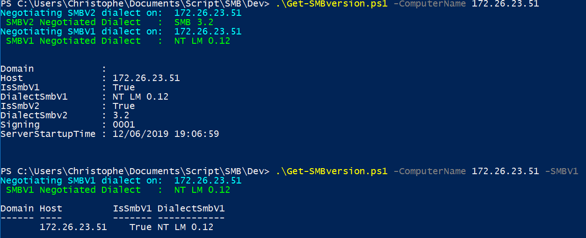
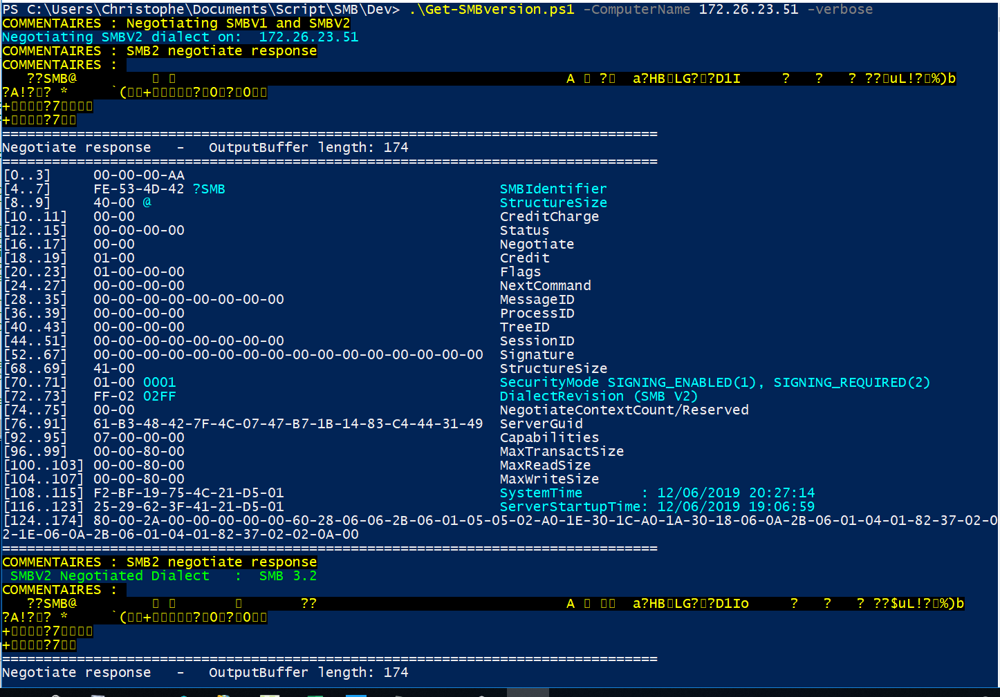
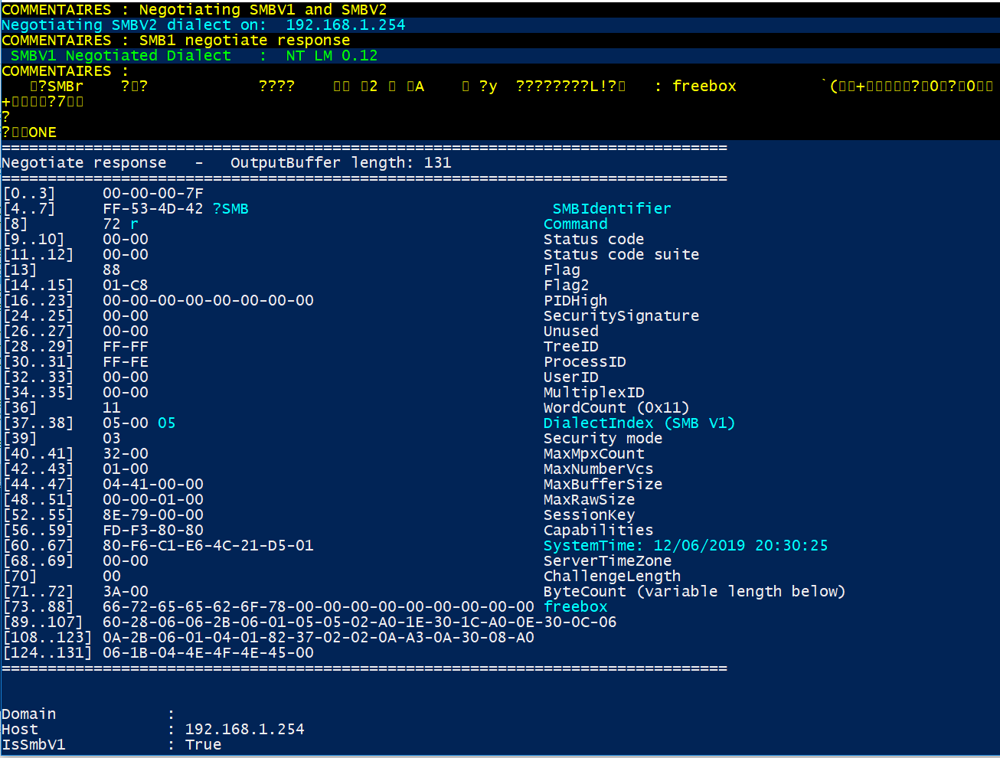

# SMB

A full powershell SMB scanner
Also Useful to get last reboot date/time
The first time, I am trying to play with Tcpclient and SMB.
Tested in production with Windows and not Windows targets

.DESCRIPTION

    Get higher SMB dialect and signing setting from a given computer name.

    No authentication required
    TCP port 445 must be reachable
    Not additional powershell module required
    Tested on windows 7, 10 and windows 2012 R2
    Use same dialect list as Windows 10.

    Function used:
        PushToTcpPort
        GetOutput

.PARAMETER

    -ComputerName   : Computer name or IP
    -TrustedDomain  : FQDN Domain Name (not used to query only to output reference)
    -SMBV1          : Query SMBV1 only
    -Verbose        : To display response packet to negotiate query

 .EXAMPLE 

    # SMBV2 and SMBV1 =================
    .\Get-SMBversion.ps1  (default current computer)
    
    .\Get-SMBversion.ps1 -ComputerName W2012R2SRV -TrustedDomain contoso.com
    Negotiating SMBV2 dialect on:  W2012R2SRV
     SMBV2 Negotiated Dialect   :  SMB 3.2
    Negotiating SMBV1 dialect on:  W2012R2SRV
     SMBV1 Negotiated Dialect   :  NT LM 0.12

    Domain            : contoso.com
    Host              : W2012R2SRV
    IsSmbV1           : True
    DialectSmbV1      : NT LM 0.12
    IsSmbV2           : True
    DialectSmbv2      : 3.2
    Signing           : 0001
    ServerStartupTime : 11/5/2018 2:21:40 PM

    # SMBV2 and SMBV1 to host supporting only SMBV2 
    .\Get-SMBversion.ps1 -ComputerName smbv2onlyhost  -TrustedDomain contoso.com
    Negotiating SMBV2 dialect on:  smbv2onlyhost
     SMBV2 Negotiated Dialect   :  SMB 3.11
    Negotiating SMBV1 dialect on:  smbv2onlyhost
     Not any requested dialects found on this host. Timeout: True

    Domain            : contos0.com
    Host              : smbv2onlyhost
    IsSmbV1           : False
    DialectSmbV1      : na
    IsSmbV2           : True
    DialectSmbv2      : 3.11
    Signing           : 0001
    ServerStartupTime : 10/8/2018 2:53:16 PM

    # SMBV1 only ======================
    .\Get-SMBversion.ps1 -ComputerName W2012R2SRV -TrustedDomain contoso.com -smbv1 
    Negotiating SMB dialect on:  W2012R2SRVT
    Negotiated Dialect        :  NT LM 0.12

    Domain       : contoso.com
    Host         : W2012R2SRV
    IsSmbV1      : True
    DialectSmbV1 : NT LM 0.12

    # Do not support pipeline option but you can use a server array
    $server = get-content .\myserverlist.txt
    $server | foreach {.\Get-SMBversion.ps1 -computername $_}
 
    Reference:
        https://msdn.microsoft.com/en-us/library/cc246482.aspx
        https://msdn.microsoft.com/en-us/library/cc246561.aspx

Screenshot

